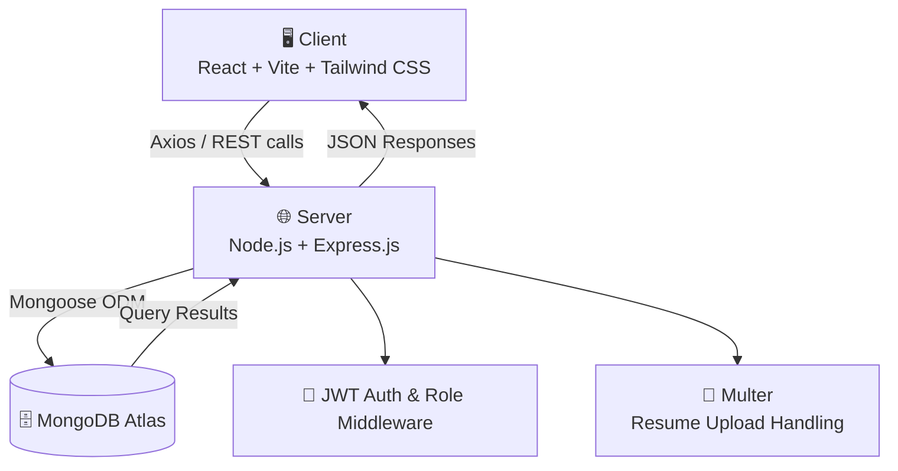
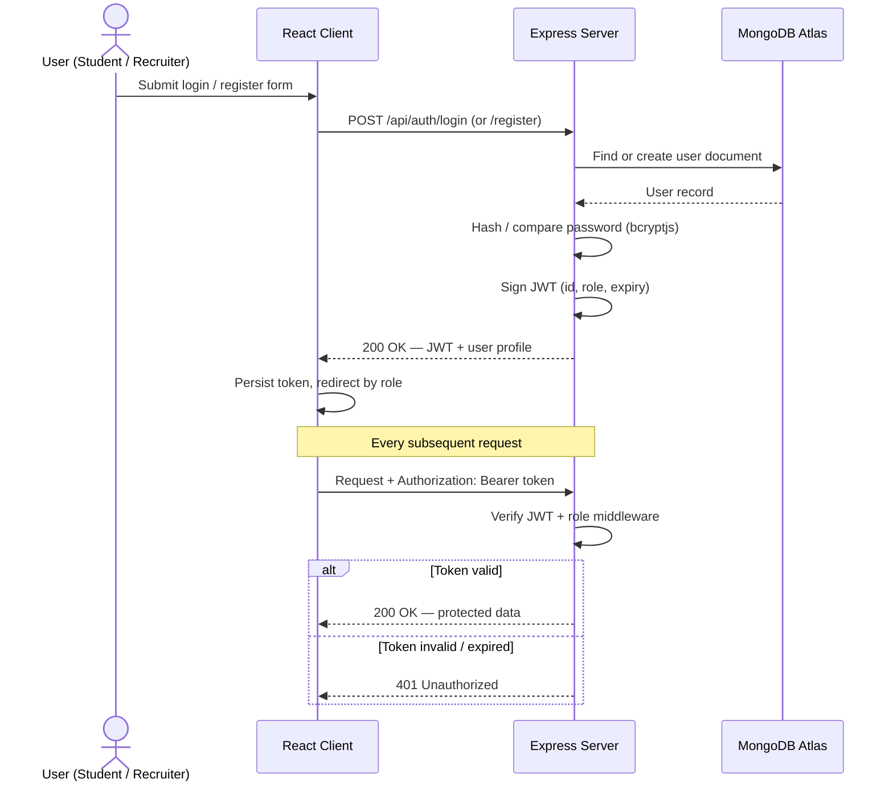
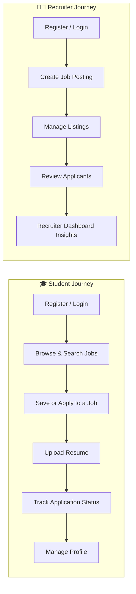

<div align="center">

# 🌐 HireVerse

### AI-Powered Hiring Platform — Built for the Next Generation of Job Seekers & Recruiters

Connecting **Students** and **Recruiters** through a secure, role-based, full-stack hiring experience.

[](https://react.dev/)
[](https://nodejs.org/)
[](https://expressjs.com/)
[](https://www.mongodb.com/atlas)
[](https://jwt.io/)
[](https://tailwindcss.com/)
[](./LICENSE)

[](https://github.com/ashutoshdeepu256-coder/job-portal/stargazers)
[](https://github.com/ashutoshdeepu256-coder/job-portal/network/members)
[](https://github.com/ashutoshdeepu256-coder/job-portal/issues)
[](./CONTRIBUTING.md)

</div>

---

## 👋 Welcome to HireVerse

**HireVerse** is a full-stack **MERN** job portal that gives students a focused space to discover and apply for jobs, and gives recruiters a lightweight applicant-tracking workflow to post roles and manage candidates — all behind a single, JWT-secured, role-based platform.

This README is written the way documentation for a production SaaS product should be written: clear architecture, real API contracts, real database design, and an honest account of what's shipped today versus what's on the roadmap.

> [!NOTE]
> The **"AI-Powered"** vision (resume analysis, smart job matching) is part of HireVerse's product roadmap — see [🚀 Future Enhancements](#future-enhancements). The current release focuses on a rock-solid, secure core hiring workflow that the AI layer will be built on top of.

---

<a name="table-of-contents"></a>
## 📚 Table of Contents

- [Project Overview](#project-overview)
- [Key Features](#key-features)
- [Tech Stack](#tech-stack)
- [Project Architecture](#project-architecture)
- [Authentication Flow](#authentication-flow)
- [Folder Structure](#folder-structure)
- [Installation Guide](#installation-guide)
- [Environment Variables](#environment-variables)
- [API Documentation](#api-documentation)
- [Database Design](#database-design)
- [Project Workflow](#project-workflow)
- [Screenshots](#screenshots)
- [Responsive Design](#responsive-design)
- [Security Features](#security-features)
- [Performance Optimizations](#performance-optimizations)
- [Challenges Faced](#challenges-faced)
- [Learning Outcomes](#learning-outcomes)
- [Future Enhancements](#future-enhancements)
- [Contributing](#contributing)
- [License](#license)
- [Author](#author)

---

<a name="project-overview"></a>
## 📖 Project Overview

HireVerse solves a problem every campus and early-career job seeker knows well: job hunting is scattered across emails, spreadsheets, and a dozen different portals, while recruiters juggle applicants across just as many disconnected channels.

HireVerse brings both sides onto one platform with two purpose-built experiences:

- **Students** get a single dashboard to browse, search, filter, save, and apply to jobs, upload a resume once, and track every application's status in one place.
- **Recruiters** get a dashboard to create and manage job listings and review the applicants for each role — no spreadsheets required.

Both experiences sit on top of the same secure backend: **JWT authentication**, **role-based authorization**, and a **REST API** built with **Express** and **MongoDB (Mongoose)**, served to a responsive **React + Tailwind CSS** frontend built with **Vite**.

**Real-world use case:** think of HireVerse as the MVP core of a campus placement portal or an early-stage startup's internal ATS (Applicant Tracking System) — the same foundation that products like Handshake, Wellfound, or a company's internal careers portal are built on, scoped down to a clean, understandable, and fully open-source implementation.

---

<a name="key-features"></a>
## ✨ Key Features

### 🎓 Student Features

| Feature | Description |
|---|---|
| Secure Registration & Login | Create a student account and authenticate via JWT |
| Browse Jobs | View all active job postings in a clean, card-based layout |
| Search Jobs | Search listings by title, company, or keyword |
| Filter Jobs | Narrow results down by relevant job criteria |
| Save Jobs | Bookmark listings to revisit later without losing them in the feed |
| Apply to Jobs | Submit an application to a recruiter directly from the job listing |
| Upload Resume | Attach a resume file to your profile, reused across applications |
| Track Applications | See the live status of every job you've applied to |
| Student Dashboard | A single home base for saved jobs, active applications, and quick stats |
| Profile Management | Update personal details and resume from a dedicated Profile page |

### 🧑‍💼 Recruiter Features

| Feature | Description |
|---|---|
| Recruiter Registration & Login | Create a recruiter account, authenticated and authorized separately from students |
| Create Jobs | Publish new job openings through a guided Create Job form |
| Update Jobs | Edit an existing listing's details after publishing |
| Delete Jobs | Remove a listing that's no longer open |
| View Posted Jobs | See every job the recruiter has published in one place |
| View Applicants | Review the list of students who applied to a specific job |
| Recruiter Dashboard | A single control center for active listings and applicant activity |

### ⚙️ Platform-Wide Capabilities

| Capability | Description |
|---|---|
| Responsive Design | Fully usable experience across desktop, tablet, and mobile |
| REST API | Clean, resource-oriented Express API consumed by the React client |
| Protected Routes | Frontend route guards + backend middleware guard private pages and endpoints |
| Password Hashing | Passwords are never stored in plain text (bcryptjs) |
| Role-Based Authentication | Students and recruiters get distinct permissions from the same auth system |
| Centralized Error Handling | Consistent, predictable error responses across the API |
| Secure Backend | Environment-based secrets, JWT verification middleware, and input checks |
| Clean Folder Structure | Clear separation of concerns across `client/` and `server/` |

---

<a name="tech-stack"></a>
## 🛠️ Tech Stack

### Frontend

| Technology | Role in HireVerse |
|---|---|
| **React 19** | Core UI library powering every page and component |
| **Vite** | Dev server + build tool for fast HMR and optimized production bundles |
| **Tailwind CSS** | Utility-first styling for a consistent, responsive design system |
| **React Router** | Client-side routing between Home, Jobs, Dashboards, Profile, etc. |
| **Axios** | HTTP client for all communication with the Express API |
| **React Hot Toast** | Lightweight, non-blocking success/error notifications |
| **Framer Motion** | Page and component-level animation |
| **Lucide React / React Icons** | Icon system used across the UI |

### Backend & Database

| Technology | Role in HireVerse |
|---|---|
| **Node.js** | JavaScript runtime for the server |
| **Express.js** | REST API framework — routing, middleware, controllers |
| **MongoDB Atlas** | Cloud-hosted NoSQL database |
| **Mongoose** | Schema modeling, validation, and querying for MongoDB |
| **JSON Web Tokens (JWT)** | Stateless, signed authentication tokens |
| **bcryptjs** | One-way password hashing before storage |
| **Multer** | Multipart/form-data handling for resume uploads |

### Tooling

| Tool | Purpose |
|---|---|
| **Git & GitHub** | Version control and collaboration |
| **VS Code** | Primary development environment |
| **npm** | Package management and script orchestration |

---

<a name="project-architecture"></a>
## 🏗️ Project Architecture

HireVerse follows a classic **three-tier MERN architecture**: a React SPA talks to an Express REST API, which is the only layer allowed to talk to MongoDB.



**Why this shape?**

- The **client** never talks to MongoDB directly — every read/write goes through validated, authenticated Express routes.
- **Middleware** (JWT verification, role checks, error handling) is centralized on the server, so every route gets the same security guarantees for free.
- The **root `package.json`** orchestrates both halves of the project (`install:server`, `install:client`, `build:client`, `start:server`), so the whole app can be installed and built with a single command — see [Installation Guide](#installation-guide).

---

<a name="authentication-flow"></a>
## 🔐 Authentication Flow

Authentication is stateless: the server issues a signed JWT on login/registration, and the client attaches it to every subsequent request.



The **role** encoded in the token (`student` or `recruiter`) is what drives route protection on both sides — the React app renders the correct dashboard, and the Express middleware rejects requests to endpoints outside that role's permissions.

---

<a name="folder-structure"></a>
## 📁 Folder Structure

```
job-portal/
├── client/                          # React + Vite frontend
│   ├── public/
│   ├── src/
│   │   ├── assets/                  # Images, logos, static assets
│   │   ├── components/              # Reusable UI (Navbar, JobCard, ProtectedRoute, etc.)
│   │   ├── pages/                   # Route-level pages
│   │   │   ├── Home.jsx
│   │   │   ├── Jobs.jsx
│   │   │   ├── Login.jsx
│   │   │   ├── Register.jsx
│   │   │   ├── StudentDashboard.jsx
│   │   │   ├── RecruiterDashboard.jsx
│   │   │   ├── Profile.jsx
│   │   │   └── CreateJob.jsx
│   │   ├── context/                 # AuthContext — user/session state
│   │   ├── hooks/                   # Custom hooks (useAuth, useFetch, etc.)
│   │   ├── utils/                   # Axios instance, helpers, constants
│   │   ├── App.jsx
│   │   └── main.jsx
│   ├── index.html
│   ├── tailwind.config.js
│   ├── vite.config.js
│   └── package.json
│
├── server/                          # Node.js + Express backend
│   ├── config/                      # DB connection & environment setup
│   │   └── db.js
│   ├── controllers/                 # Route logic (auth, jobs, applications, users)
│   ├── middleware/                  # JWT guard, role guard, error handler, multer config
│   ├── models/                      # Mongoose schemas (User, Job, Application)
│   ├── routes/                      # Express routers
│   ├── uploads/                     # Uploaded resumes (Multer storage)
│   ├── server.js                    # App entry point
│   └── package.json
│
├── .gitignore
├── package.json                     # Root orchestration scripts
└── README.md
```

---

<a name="installation-guide"></a>
## ⚙️ Installation Guide

### Prerequisites

- Node.js **v18+**
- npm
- A MongoDB Atlas cluster (or local MongoDB instance)
- Git

### 1. Clone the Repository

```bash
git clone https://github.com/ashutoshdeepu256-coder/job-portal.git
cd job-portal
```

### 2. Quick Setup (Recommended)

The root `package.json` orchestrates the entire project:

```bash
npm install
```

This automatically runs `install:server`, `install:client`, and `build:client`, so both dependency trees are installed and the frontend is production-built in a single step.

### 3. Configure Environment Variables

Create the required `.env` files as described in [Environment Variables](#environment-variables) before starting the app.

### 4. Run the Application

**Single-command (production-style):**

```bash
npm start
```

This runs `start:server`, which boots the Express server on the configured `PORT`.

**Development mode (recommended while building/contributing):**

```bash
# Terminal 1 — Backend
cd server
npm install
npm start

# Terminal 2 — Frontend with Vite hot reload
cd client
npm install
npm run dev
```

The Vite dev server typically runs on `http://localhost:5173` and calls the API on `http://localhost:5000`.

---

<a name="environment-variables"></a>
## 🔑 Environment Variables

Create a `.env` file inside **`/server`**:

```env
PORT=5000
MONGO_URI=your_mongodb_atlas_connection_string
JWT_SECRET=your_super_secret_jwt_key
JWT_EXPIRES_IN=7d
NODE_ENV=development
CLIENT_URL=http://localhost:5173
```

Create a `.env` file inside **`/client`** (Vite only exposes variables prefixed with `VITE_`):

```env
VITE_API_BASE_URL=http://localhost:5000/api
```

> [!TIP]
> Never commit `.env` files. Commit a `.env.example` (with placeholder values, exactly like the blocks above) instead, so contributors know which keys are required.

---

<a name="api-documentation"></a>
## 📡 API Documentation

Base URL (development): `http://localhost:5000/api`

### 🔐 Authentication APIs

| Method | Endpoint | Description | Access |
|---|---|---|---|
| `POST` | `/auth/register` | Register a new student or recruiter account | Public |
| `POST` | `/auth/login` | Authenticate a user and return a JWT | Public |
| `GET` | `/auth/me` | Get the currently authenticated user's data | Private |

### 💼 Job APIs

| Method | Endpoint | Description | Access |
|---|---|---|---|
| `GET` | `/jobs` | Get all jobs (supports search & filter query params) | Public |
| `GET` | `/jobs/:id` | Get details for a single job | Public |
| `POST` | `/jobs` | Create a new job listing | Private (Recruiter) |
| `PUT` | `/jobs/:id` | Update an existing job listing | Private (Recruiter, Owner) |
| `DELETE` | `/jobs/:id` | Delete a job listing | Private (Recruiter, Owner) |
| `GET` | `/jobs/recruiter/my-jobs` | Get all jobs posted by the logged-in recruiter | Private (Recruiter) |

### 📄 Application APIs

| Method | Endpoint | Description | Access |
|---|---|---|---|
| `POST` | `/applications` | Apply to a job | Private (Student) |
| `GET` | `/applications/my-applications` | Get the logged-in student's applications | Private (Student) |
| `GET` | `/applications/job/:jobId` | Get all applicants for a specific job | Private (Recruiter, Owner) |
| `PUT` | `/applications/:id/status` | Update an application's status | Private (Recruiter) |

### 👤 User & Recruiter APIs

| Method | Endpoint | Description | Access |
|---|---|---|---|
| `GET` | `/users/profile` | Get the logged-in user's profile | Private |
| `PUT` | `/users/profile` | Update profile details | Private |
| `POST` | `/users/resume` | Upload or replace a resume file | Private (Student) |
| `POST` | `/users/save-job/:jobId` | Save/bookmark a job | Private (Student) |
| `GET` | `/users/saved-jobs` | Get all saved jobs | Private (Student) |

> [!NOTE]
> These endpoints reflect HireVerse's current REST design. If route names in `server/routes` evolve, keep this table in sync so the docs stay trustworthy.

---

<a name="database-design"></a>
## 🗄️ Database Design

HireVerse uses **three core MongoDB collections**, modeled with Mongoose.

### `Users`

| Field | Type | Notes |
|---|---|---|
| `_id` | ObjectId | Primary key |
| `name` | String | Full name |
| `email` | String | Unique, used for login |
| `password` | String | Hashed with bcryptjs, never stored in plain text |
| `role` | String (enum) | `student` \| `recruiter` |
| `resume` | String | Path/URL to uploaded resume (students) |
| `savedJobs` | [ObjectId] | References to `Jobs` (students) |
| `companyName` | String | Recruiter's organization (recruiters) |
| `createdAt` | Date | Account creation timestamp |

### `Jobs`

| Field | Type | Notes |
|---|---|---|
| `_id` | ObjectId | Primary key |
| `title` | String | Job title |
| `description` | String | Full role description |
| `requirements` | [String] | Required skills/qualifications |
| `location` | String | Job location |
| `type` | String (enum) | e.g. `full-time`, `part-time`, `internship` |
| `postedBy` | ObjectId | Reference to the recruiter (`Users`) |
| `status` | String (enum) | `open` \| `closed` |
| `createdAt` | Date | Listing creation timestamp |

### `Applications`

| Field | Type | Notes |
|---|---|---|
| `_id` | ObjectId | Primary key |
| `job` | ObjectId | Reference to `Jobs` |
| `applicant` | ObjectId | Reference to `Users` (student) |
| `resume` | String | Snapshot of the resume used for this application |
| `status` | String (enum) | `applied` \| `reviewed` \| `shortlisted` \| `rejected` |
| `appliedAt` | Date | Application timestamp |

Using `ObjectId` references between `Jobs → Users` and `Applications → Jobs/Users` keeps the data normalized while still giving MongoDB's document model room to breathe — a job's applicant list is just a query away via `Applications.find({ job: id })`.

---

<a name="project-workflow"></a>
## 🔄 Project Workflow



**Student Flow:** register/log in → browse or search the jobs feed → save interesting roles and/or apply directly → upload a resume once and reuse it → track every application's status from the Student Dashboard.

**Recruiter Flow:** register/log in as a recruiter → publish a role via Create Job → manage active listings (update/delete) from the Recruiter Dashboard → open any listing to review its applicants.

**Backend Flow:** every request hits Express → passes through JWT verification and role middleware for protected routes → the relevant controller runs validation and business logic → Mongoose reads/writes to MongoDB Atlas → a JSON response goes back to the client, with errors normalized by a central error handler.

---

<a name="screenshots"></a>
## 🖼️ Screenshots

| Page | Preview |
|---|---|
| 🏠 Home Page |
) |
| 🔐 Login Page |
 |
| 📝 Register Page |
 |
| 💼 Jobs Page | 
 |
| 🎓 Student Dashboard | 
 |
| 🧑‍💼 Recruiter Dashboard | 
 |
| 👤 Profile Page | 

 |
| ➕ Create Job Page |
 |

---

<a name="responsive-design"></a>
## 📱 Responsive Design

Every page in HireVerse — from the Home page to both dashboards — is built mobile-first with **Tailwind CSS**'s responsive utility classes. Layouts reflow across breakpoints (mobile, tablet, desktop) rather than simply shrinking, so navigation, job cards, and dashboard widgets stay usable on a phone, not just presentable.

---

<a name="security-features"></a>
## 🔒 Security Features

| Layer | Implementation |
|---|---|
| **Authentication** | Stateless JWT issued on login/registration, verified on every protected request |
| **Password Storage** | One-way hashing via `bcryptjs` — plain-text passwords are never persisted |
| **Authorization** | Role-based middleware ensures students and recruiters can only reach endpoints meant for their role |
| **Protected Routes** | Both the Express API and the React Router config guard private pages/endpoints |
| **Input Validation** | Controller-level validation before any write hits MongoDB |
| **Secrets Management** | Sensitive config (DB URI, JWT secret) kept in `.env`, never committed to source control |

---

<a name="performance-optimizations"></a>
## ⚡ Performance Optimizations

- **Lazy Loading** — route-level code-splitting so pages load only the JavaScript they need.
- **Efficient API Calls** — a shared Axios instance with centralized base URL/config to avoid redundant setup and requests.
- **Optimized Rendering** — memoization patterns (`useMemo` / `useCallback`) to avoid unnecessary re-renders on data-heavy pages like the Jobs feed and dashboards.
- **Reusable Components** — a shared component layer (cards, buttons, form inputs) keeps bundle size and design drift down.
- **Vite Build Pipeline** — fast HMR in development and a minified, tree-shaken bundle in production.

---

<a name="challenges-faced"></a>
## 🧩 Challenges Faced

- **Designing one auth system for two very different roles** — students and recruiters share a login flow but need completely different dashboards, permissions, and data shapes.
- **Resume uploads done right** — handling `multipart/form-data` reliably with Multer, including file-type and size constraints, without blocking the rest of the request pipeline.
- **Keeping the REST API predictable** — as features grew (jobs → applications → saved jobs), keeping route naming, response shapes, and error formats consistent took deliberate API design, not just "make it work."
- **Responsive dashboards, not just responsive pages** — dashboards have more moving parts (lists, stats, actions) than marketing pages, which made mobile layout decisions harder than the public-facing Home/Jobs pages.
- **State without prop-drilling** — managing auth/session state across many pages cleanly, instead of passing props down multiple component layers.

---

<a name="learning-outcomes"></a>
## 🎓 Learning Outcomes

Building HireVerse end-to-end reinforced:

- Practical, production-style **JWT authentication and role-based authorization** in a MERN app.
- **REST API design principles** — resource naming, status codes, and consistent error handling.
- Handling **file uploads** in Express with Multer, and the tradeoffs around storage.
- Building **responsive, component-driven UIs** with React and Tailwind CSS at real app scale (not just a landing page).
- **MongoDB schema design** for relational-feeling data (users, jobs, applications) using references instead of forcing everything into embedded documents.
- Disciplined **Git/GitHub workflow** for a multi-part (client + server) codebase.

---

<a name="future-enhancements"></a>
## 🚀 Future Enhancements

| Feature | Status |
|---|---|
| 🤖 AI Resume Analyzer | Planned |
| 🎯 AI-Powered Job Recommendations | Planned |
| 📧 Email Notifications | Planned |
| 📅 Interview Scheduling | Planned |
| 🛡️ Admin Dashboard | Planned |
| 🏢 Company Profiles | Planned |
| 🔖 Cross-Device Saved Jobs Sync | Planned |
| 🌙 Dark Mode | Planned |
| 📄 Pagination on Jobs & Applicants | Planned |
| 🔔 In-App Notifications | Planned |

This roadmap is exactly what turns HireVerse from a solid MERN hiring MVP into the "AI-Powered Hiring Platform" its tagline promises — contributions toward any of the above are very welcome.

---

<a name="contributing"></a>
## 🤝 Contributing

Contributions make the open-source community an incredible place to learn and build. Any contribution is **greatly appreciated**.

1. **Fork** the repository
2. **Create your feature branch**
   ```bash
   git checkout -b feature/amazing-feature
   ```
3. **Commit your changes** with a clear message
   ```bash
   git commit -m "feat: add amazing feature"
   ```
4. **Push to your branch**
   ```bash
   git push origin feature/amazing-feature
   ```
5. **Open a Pull Request** describing what you changed and why

> [!TIP]
> Please keep the client/server separation intact and follow the existing folder conventions (`controllers/`, `routes/`, `models/`, `middleware/` on the backend; `pages/`, `components/`, `context/`, `hooks/` on the frontend) so the codebase stays easy to navigate as it grows.

---

<a name="license"></a>
## 📄 License

This project is licensed under the **MIT License**. See [`LICENSE`](./LICENSE) for the full text — in short, you're free to use, modify, and distribute this project, provided the original copyright notice is retained.

---

<a name="Ashutosh"></a>
## 👤 Ashutosh

**HireVerse** is built and maintained by:

- GitHub: [@ashutoshdeepu256-coder](https://github.com/ashutoshdeepu256-coder)
- Repository: [job-portal](https://github.com/ashutoshdeepu256-coder/job-portal)
- LinkedIn: [Ashutosh Gupta](https://www.linkedin.com/in/ashutosh-gupta-ba31652a1?utm_source=share_via&utm_content=profile&utm_medium=member_android)
- Email: ashutoshdeepu256@gmail.com

<div align="center">

### ⭐ If HireVerse helped you or you find it interesting, consider starring the repository!

</div>
